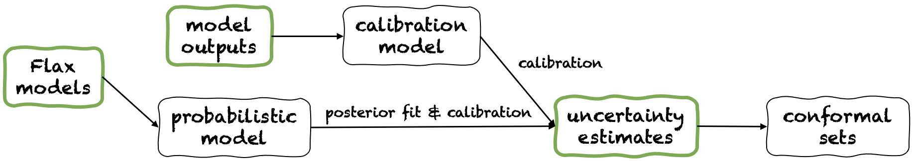

Fortuna
#######
A Library for Uncertainty Quantification
========================================
Proper estimation of predictive uncertainty is fundamental in applications that involve critical decisions.
It can be used to assess reliability of model predictions, trigger human intervention,
or decide whether a model can be safely deployed in the wild.

Fortuna is a library for uncertainty quantification that makes it easy for users to run benchmarks and bring uncertainty to production systems.
Fortuna provides calibration and conformal methods starting from pre-trained models written in any framework,
and it further supports several Bayesian inference methods starting from Flax deep learning models.
The language is designed to be intuitive for practitioners unfamiliar with uncertainty quantification,
and is highly configurable.

Usage modes
===========
Fortuna offers three different usage modes:
`From uncertainty estimates <https://github.com/awslabs/fortuna#from-uncertainty-estimates>`_,
`From model outputs <https://github.com/awslabs/fortuna#from-model-outputs>`_ and
`From Flax models <https://github.com/awslabs/fortuna#from-flax-models>`_.
These serve users according to the constraints dictated by their own applications.
Their pipelines are depicted in the following figure, each starting from one of the green panels.

From uncertainty estimates
---------------------------
Starting from uncertainty estimates has minimal compatibility requirements and it is the quickest level of interaction with the library.
This usage mode offers conformal prediction methods for both classification and regression.
These take uncertainty estimates in input, and return rigorous sets of predictions that are likely at a user-given probability level (e.g. 95%).
In one-dimensional regression tasks, conformal sets may as well be thought as calibrated intervals of predictions.

Mind that if the uncertainty estimates that you provide in inputs are inaccurate,
conformal sets might be large and unusable.
For this reason, if your application allows it,
please consider the `From model outputs <https://github.com/awslabs/fortuna#from-model-outputs>`_ and
`From Flax models <https://github.com/awslabs/fortuna#from-flax-models>`_ usage modes.

**Example.** Suppose you want to calibrate credible intervals with coverage error :code:`error`,
each corresponding to a different test input variable.
We assume that credible intervals are passed as arrays of lower and upper bounds,
respectively :code:`test_lower_bounds` and :code:`test_upper_bounds`.
You also have lower and upper bounds of credible intervals computed for several validation inputs,
respectively :code:`val_lower_bounds` and :code:`val_upper_bounds`.
The corresponding array of validation targets is denoted by :code:`val_targets`.
The following code produces *conformal prediction intervals*,
i.e. calibrated versions of you test credible intervals.

.. code-block:: python

 from fortuna.conformer.regression import QuantileConformalRegressor
 conformal_intervals = QuantileConformalRegressor().conformal_interval(
      val_lower_bounds=val_lower_bounds, val_upper_bounds=val_upper_bounds,
      test_lower_bounds=test_lower_bounds, test_upper_bounds=test_upper_bounds,
      val_targets=val_targets, error=error)

From model outputs
------------------
Starting from model outputs assumes you have already trained a model in some framework,
and arrive to Fortuna with model outputs in :code:`numpy.ndarray` format for each input data point.
This usage mode allows you to calibrate your model outputs, estimate uncertainty,
compute metrics and, like in the  before, obtain conformal sets.

Compared to the `From uncertainty estimates <https://github.com/awslabs/fortuna#from-uncertainty-estimates>`_ usage mode,
this one offers better control,
as it can make sure uncertainty estimates have been appropriately calibrated.
However, if those estimates were obtained with classical training methods,
they may not capture model epistemic uncertainty,
thereby hindering the quality of the predictive uncertainty estimates overall.
To mitigate this problem, please consider the `From Flax models <https://github.com/awslabs/fortuna#from-flax-models>`_
usage mode.

**Example.**
Suppose you have validation and test model outputs,
respectively :code:`val_outputs` and :code:`test_outputs`.
Furthermore, you have some arrays of validation and target variables,
respectively :code:`val_targets` and :code:`test_targets`.
The following code provides a minimal classification example to get calibrated predictive entropy estimates.

.. code-block:: python

  from fortuna.calib_model import CalibClassifier
  calib_model = CalibClassifier()
  status = calib_model.calibrate(outputs=val_outputs, targets=val_targets)
  test_entropies = calib_model.predictive.entropy(outputs=test_outputs)

Starting from Flax models
--------------------------
Starting from Flax models has higher compatibility requirements than the
`From uncertainty estimates <https://github.com/awslabs/fortuna#from-uncertainty-estimates>`_
and `From model outputs <https://github.com/awslabs/fortuna#from-model-outputs>`_ usage modes,
as it needs you to build or choose a deep learning model in `Flax <https://flax.readthedocs.io/en/latest/index.html>`_.
However, it enables you to replace standard training with scalable Bayesian inference procedures,
which may significantly improve the quantification of predictive uncertainty.

**Example.** Suppose you have a Flax classification deep learning model :code:`model` from inputs to logits, with output
dimension given by :code:`output_dim`. Furthermore,
you have some training, validation and calibration TensorFlow data loader :code:`train_data_loader`, :code:`val_data_loader`
and :code:`test_data_loader`, respectively.
The following code provides a minimal classification example to get calibrated probability estimates.

.. code-block:: python

  from fortuna.data import DataLoader
  train_data_loader = DataLoader.from_tensorflow_data_loader(train_data_loader)
  calib_data_loader = DataLoader.from_tensorflow_data_loader(val_data_loader)
  test_data_loader = DataLoader.from_tensorflow_data_loader(test_data_loader)

  from fortuna.prob_model import ProbClassifier
  prob_model = ProbClassifier(model=model)
  status = prob_model.train(train_data_loader=train_data_loader, calib_data_loader=calib_data_loader)
  test_means = prob_model.predictive.mean(inputs_loader=test_data_loader.to_inputs_loader())

Installation
============
**NOTE:** Before installing Fortuna, you are required to `install JAX <https://github.com/google/jax#installation>`_ in your virtual environment.

You can install Fortuna by typing

.. code-block::

    pip install aws-fortuna

Examples
========
Several usage examples are found in the
`/examples <https://github.com/awslabs/fortuna/tree/main/examples>`_
directory.

Contributing
============
If you wish to contribute to the project, please refer to our `contribution guidelines <https://github.com/awslabs/fortuna/blob/main/CONTRIBUTING.md>`_.

License
=======
This project is licensed under the Apache-2.0 License.
See `LICENSE <https://github.com/awslabs/fortuna/blob/main/LICENSE>`_ for more information.
