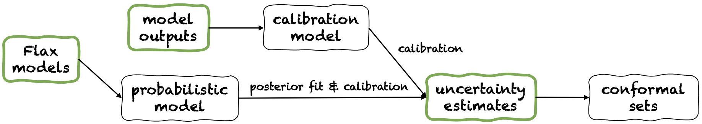

Quickstart
==========
Fortuna offers several :ref:`usage modes <usage_modes>`.
Their pipeline is depicted in the figure below.

      Fortuna's usage pipelines. You can start your journey with Fortuna from any of the green panels.

You might prefer one usage mode or the other according to your own requirements.
:ref:`From uncertainty estimates <conformal>` has minimal compatibility requirements and it is the quickest level of interaction with the library.
However, if the uncertainty estimates you provide are inaccurate,
conformal sets might be large and unusable.
:ref:`From model outputs <model_outputs>` also starts from pre-trained models but offers better control,
as it can make sure uncertainty estimates have been appropriately calibrated.
However, these may have been obtain with classical training methods,
that may not capture model (epistemic) uncertainty sufficiently well.
:ref:`From Flax models <flax_models>` has higher compatibility requirements,
as it requires you to build a deep learning model in `Flax <https://flax.readthedocs.io/en/latest/index.html>`_.
However, it enables you to replace standard training with scalable Bayesian inference procedures,
which may significantly improve the quantification of predictive uncertainty.

The next paragraphs offer more details about each of these usage modes.

:ref:`From uncertainty estimates <conformal>`.
   You bring data and predictive uncertainty estimates.
   Fortuna provides rigorous conformal prediction sets,
   i.e. sets of predictions at a certain probability level.

   **Example.** Suppose you want to calibrate credible intervals with coverage error :code:`error`,
   each corresponding to a different test input variable.
   We assume that credible intervals are passed as arrays of lower
   and upper bounds,
   respectively :code:`test_lower_bounds` and :code:`test_upper_bounds`.
   You also have lower and upper bounds of credible intervals computed for several validation inputs,
   respectively :code:`val_lower_bounds` and :code:`val_upper_bounds`.
   The corresponding array of validation targets is denoted by :code:`val_targets`.
   The following code produces *conformal prediction intervals*,
   i.e. calibrated versions of you test credible intervals.

   .. code-block:: python
      :caption: **References:** :meth:`~fortuna.conformer.regression.QuantileConformalRegressor.conformal_interval`

       from fortuna.conformer.regression import QuantileConformalRegressor
       conformal_intervals = QuantileConformalRegressor().conformal_interval(
            val_lower_bounds=val_lower_bounds,
            val_upper_bounds=val_upper_bounds,
            test_lower_bounds=test_lower_bounds,
            test_upper_bounds=test_upper_bounds,
            val_targets=val_targets,
            error=error
       )

:ref:`From model outputs <model_outputs>`.
   You bring data and outputs from a pre-trained model.
   Fortuna calibrates the model outputs,
   provides calibrated predictive uncertainty estimates and conformal prediction sets.

   **Example.**
   Suppose you have validation and test model outputs,
   respectively :code:`val_outputs` and :code:`test_outputs`.
   Furthermore, you have some arrays of validation and target variables,
   respectively :code:`val_targets` and :code:`test_targets`.
   The following code provides a minimal classification example to get calibrated uncertainty estimates,
   compute metrics and conformal sets.

   .. code-block:: python
      :caption: **References:** :class:`~fortuna.calib_model.classification.CalibClassifier`, :meth:`~fortuna.calib_model.classification.CalibClassifier.calibrate`, :meth:`~fortuna.calib_model.predictive.classification.ClassificationPredictive.mean`, :meth:`~fortuna.calib_model.predictive.classification.ClassificationPredictive.mode`, :func:`~fortuna.metric.classification.accuracy`, :func:`~fortuna.metric.classification.expected_calibration_error`, :meth:`~fortuna.conformer.classification.AdaptivePredictionConformalClassifier.conformal_set`

      # define a calibrations model
      from fortuna.calib_model import CalibClassifier
      calib_model = CalibClassifier()

      # calibrate the model outputs
      status = calib_model.calibrate(
            outputs=val_outputs,
            targets=val_targets
      )

      # make predictions
      test_means = calib_model.predictive.mean(
            outputs=test_outputs
      )
      test_modes = calib_model.predictive.mode(
            outputs=test_outputs
      )

      # compute metrics
      from fortuna.metric.classification import accuracy, expected_calibration_error
      acc = accuracy(
            preds=test_modes,
            targets=test_targets
      )
      ece = expected_calibration_error(
            preds=test_modes,
            probs=test_means,
            targets=test_targets
      )

      # compute conformal sets
      from fortuna.conformer.classification import AdaptivePredictionConformalClassifier
      val_means = calib_model.predictive.mean(
            outputs=val_outputs
      )
      conformal_sets = AdaptivePredictionConformalClassifier().conformal_set(
            val_probs=val_means,
            test_probs=test_means,
            val_targets=val_targets
      )

:ref:`From Flax models <flax_models>`.
   You bring data and a deep learning model written in `Flax <https://flax.readthedocs.io/>`__
   (powered by `JAX <https://jax.readthedocs.io/en/latest/>`__).
   Fortuna does Bayesian inference and calibration,
   provides calibrated predictive uncertainty estimates and conformal prediction sets.

   **Example.** Suppose you have a Flax classification deep learning model :code:`model` from inputs to logits, with output
   dimension given by :code:`output_dim`. Furthermore,
   you have some training, validation and calibration TensorFlow data loader :code:`train_data_loader`, :code:`val_data_loader`
   and :code:`test_data_loader`, respectively.
   The following code provides a minimal classification example to get calibrated uncertainty estimates,
   compute metrics and conformal sets.

   .. code-block:: python
      :caption: **References:** :meth:`~fortuna.data.loader.DataLoader.from_tensorflow_data_loader`, :class:`~fortuna.prob_model.classification.ProbClassifier`, :meth:`~fortuna.prob_model.classification.ProbClassifier.train`, :meth:`~fortuna.prob_model.predictive.classification.ClassificationPredictive.mean`, :meth:`~fortuna.prob_model.predictive.classification.ClassificationPredictive.mode`, :func:`~fortuna.metric.classification.accuracy`, :func:`~fortuna.metric.classification.expected_calibration_error`, :meth:`~fortuna.conformer.classification.AdaptivePredictionConformalClassifier.conformal_set`

      # convert data loaders
      from fortuna.data import DataLoader
      train_data_loader = DataLoader.from_tensorflow_data_loader(
            train_data_loader
      )
      calib_data_loader = DataLoader.from_tensorflow_data_loader(
            val_data_loader
      )
      test_data_loader = DataLoader.from_tensorflow_data_loader(
            test_data_loader
      )

      # define a probabilistic model
      from fortuna.prob_model import ProbClassifier
      prob_model = ProbClassifier(
            model=model
      )

      # train the probabilistic model
      status = prob_model.train(
            train_data_loader=train_data_loader,
            calib_data_loader=calib_data_loader
      )

      # make predictions
      test_means = prob_model.predictive.mean(
            inputs_loader=test_data_loader.to_inputs_loader()
      )
      test_modes = prob_model.predictive.mode(
            inputs_loader=test_data_loader.to_inputs_loader()
      )

      # compute metrics
      from fortuna.metric.classification import accuracy, expected_calibration_error
      acc = accuracy(
            preds=test_modes,
            targets=test_data_loader.to_array_targets()
      )
      ece = expected_calibration_error(
            preds=test_modes,
            probs=test_means,
            targets=test_data_loader.to_array_targets()
      )

      # compute conformal sets
      from fortuna.conformer.classification import AdaptivePredictionConformalClassifier
      val_means = prob_model.predictive.mean(
            inputs_loader=val_data_loader.to_inputs_loader()
      )
      conformal_sets = AdaptivePredictionConformalClassifier().conformal_set(
            val_probs=val_means,
            test_probs=test_means,
            val_targets=val_data_loader.to_array_targets()
      )

